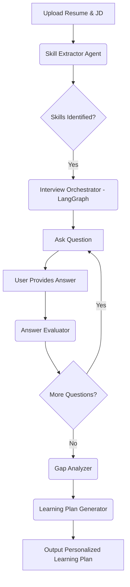

# Catalyst: AI-Powered Skill Assessment & Personalised Learning Plan Agent

## Overview
Catalyst is an AI-powered agent built with **LangGraph**, **LangChain**, and **Streamlit**. It takes a Job Description (JD) and a candidate's resume, identifies core skills, and conducts a conversational technical interview to assess *real* proficiency. After the assessment, it generates a highly personalized learning plan tailored to the candidate's skill gaps.

## Architecture



## Scoring and Logic
1. **Extraction**: The `extract_skills_node` analyzes the JD and Resume to find 3-5 core technical skills that are required by the JD but may lack clear evidence in the resume.
2. **Assessment Loop**: LangGraph orchestrates the interview. The `generate_question_node` creates an open-ended, scenario-based question to test *actual* proficiency for a skill, rather than trivia.
3. **Evaluation**: After the user responds, the `evaluate_answer_node` scores the answer from 0-5 and assigns a proficiency level (Novice, Intermediate, Advanced, Expert) using structured output.
4. **Learning Plan**: The `generate_learning_plan_node` contrasts the required proficiency for the role against the evaluated proficiency and outputs a study plan with estimated hours and curated resources.

## Local Setup Instructions

1. Clone the repository.
2. Create a virtual environment and install dependencies:
   ```bash
   python -m venv venv
   source venv/bin/activate  # On Windows use: .\venv\Scripts\activate
   pip install -r requirements.txt
   ```
3. Add your Google Gemini API Key to the `.env` file:
   ```
   GOOGLE_API_KEY=your_api_key_here
   ```
4. Run the Streamlit application:
   ```bash
   streamlit run app.py
   ```

## Sample Inputs and Outputs

**Sample Input (JD):**
"Looking for a Backend Python Developer experienced with Django, PostgreSQL, and REST APIs. Experience with Docker and CI/CD pipelines is a plus."

**Sample Input (Resume):**
"Software Engineer with 2 years of experience. Built applications using Python and Flask. Some experience with SQL databases like MySQL."

**Sample Output (Learning Plan Excerpt):**
- **Goal**: Master Django ORM and REST Framework.
- **Resource**: Build a simple blog API using Django REST Framework (DRF) and read the official DRF tutorial.
- **Time Estimate**: 15 hours.
- **Goal**: Transition from MySQL to PostgreSQL and containerize the app.
- **Resource**: Dockerize the Django blog API and use Docker Compose to spin up a PostgreSQL instance.
- **Time Estimate**: 10 hours.
