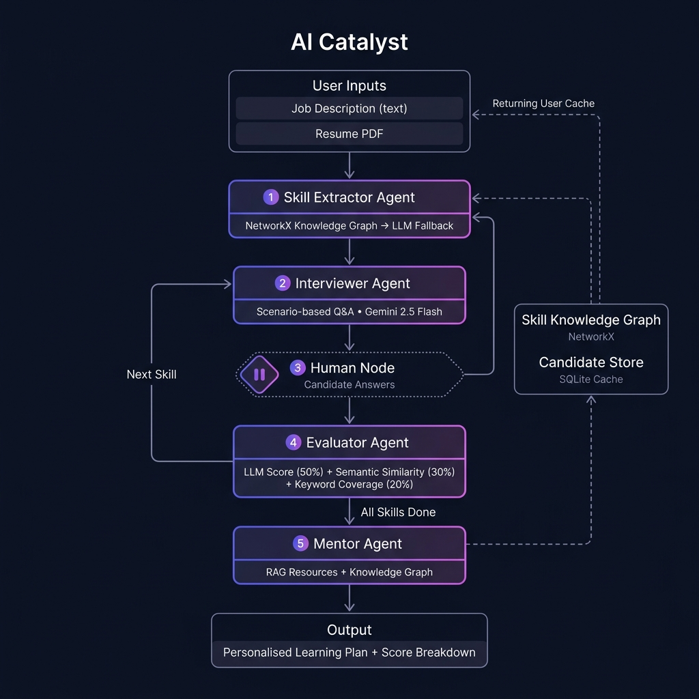

# Catalyst: AI-Powered Skill Assessment & Personalised Learning Plan Agent

> A resume tells you what someone *claims* to know — not how well they actually know it. Catalyst bridges that gap.

## Overview

Catalyst is a multi-agent AI system built with **LangGraph**, **LangChain**, and **Gemini 2.5 Flash**. It takes a Job Description and a candidate's resume, identifies the most critical skill gaps, conducts a real conversational technical interview, and generates a personalised learning plan grounded in curated resources.

## Architecture



### How It Works

The system is a **LangGraph state machine** orchestrating 4 specialised agents:

```
User Inputs (JD + Resume)
        │
        ▼
┌─────────────────────┐     ┌────────────────────────┐
│  Skill Extractor    │────▶│  Skill Knowledge Graph │
│  Agent              │     │  (NetworkX, 50+ skills)│
└─────────────────────┘     └────────────────────────┘
        │  Skills to assess (top 3–5)
        ▼
┌─────────────────────┐
│  Interviewer Agent  │◀──── Loop: Next Skill
│  (Gemini 2.5 Flash) │
└─────────────────────┘
        │  Question generated
        ▼
┌─────────────────────┐
│   Human Node        │  ◀── Candidate types answer
│   (LangGraph pause) │
└─────────────────────┘
        │  Answer received
        ▼
┌─────────────────────┐
│  Evaluator Agent    │──── All skills done ───▶
│  Hybrid Scorer      │                          │
└─────────────────────┘                          │
        │  Loop back                             ▼
        └──────────────────────────────▶ ┌──────────────┐
                                         │ Mentor Agent │
                                         │ (Learning    │
                                         │  Plan)       │
                                         └──────────────┘
                                                │
                                                ▼
                                    Personalised Learning Plan
                                      + Score Breakdown
```

## Agent Descriptions

| Agent | Role | Technology |
|---|---|---|
| **Skill Extractor** | Identifies 3–5 critical skills to assess from JD vs Resume | NetworkX Knowledge Graph + LLM fallback |
| **Interviewer** | Generates scenario-based questions (not trivia) per skill | Gemini 2.5 Flash, temp=0.8 |
| **Evaluator** | Scores each answer using 3 signals | Hybrid Engine (LLM + Semantic + Keywords) |
| **Mentor** | Generates a 4–6 week learning plan with real resources | Gemini 2.5 Flash + Curated Resource KB |

## Hybrid Scoring Engine

Answers are evaluated using a weighted combination of three independent signals:

| Signal | Weight | Method |
|---|---|---|
| LLM Qualitative Score | 50% | Gemini rates 0–5 with structured output |
| Semantic Similarity | 30% | `sentence-transformers` cosine similarity vs gold-standard answer |
| Keyword Coverage | 20% | Fraction of expected technical keywords found in answer |

## The "Hybrid Brain" — Beyond Pure LLM

Catalyst deliberately avoids relying solely on an LLM for every decision:

- **Skill Knowledge Graph** (NetworkX) — 50+ skills mapped with prerequisites and adjacency. Skill identification is deterministic — no hallucination.
- **Candidate Knowledge Base** (SQLite) — Resume text is cached by MD5 hash. Returning users get instant loading without re-parsing.
- **Curated Resource KB** — 35+ hand-picked learning resources stored in-memory. Learning plan links are real, verified URLs.

## Local Setup

1. **Clone the repository:**
   ```bash
   git clone https://github.com/Purnima2004/Catalyst-project.git
   cd Catalyst-project
   ```

2. **Create a virtual environment and install dependencies:**
   ```bash
   python -m venv venv
   venv\Scripts\activate      # Windows
   # source venv/bin/activate  # macOS/Linux
   pip install -r requirements.txt
   ```

3. **Set your Google Gemini API Key:**
   ```bash
   # Create a .env file in the project root
   GOOGLE_API_KEY=your_key_here
   ```
   Get a free key at: https://aistudio.google.com/app/apikey

4. **Run the app:**
   ```bash
   streamlit run app.py
   ```

## Sample Inputs & Outputs

**Sample Job Description:**
> "Looking for a Backend Python Developer experienced with Django, PostgreSQL, and REST APIs. Experience with Docker and CI/CD pipelines is a plus."

**Sample Resume:**
> "Software Engineer with 2 years of experience. Built applications using Python and Flask. Some experience with SQL databases like MySQL."

**Identified Skills to Assess:** Django, PostgreSQL, Docker

**Sample Score Output:**
| Skill | Score | Proficiency |
|---|---|---|
| Django | 3.2 / 5 | Intermediate |
| PostgreSQL | 2.1 / 5 | Beginner |
| Docker | 1.8 / 5 | Beginner |

**Sample Learning Plan Excerpt:**
- **Week 1–2 — Django:** Complete the Django REST Framework tutorial. Build a blog API with authentication. *(~14 hours)*
- **Week 3 — PostgreSQL:** Migrate from MySQL to PostgreSQL using Docker Compose. Study indexing and query optimization. *(~10 hours)*
- **Week 4 — Docker:** Dockerize the blog API. Set up a CI/CD pipeline with GitHub Actions. *(~8 hours)*

## Tech Stack

| Layer | Technology |
|---|---|
| LLM | Google Gemini 2.5 Flash |
| Orchestration | LangGraph (StateGraph + MemorySaver) |
| Chains & Prompts | LangChain + LangChain-Google-GenAI |
| Knowledge Graph | NetworkX |
| Semantic Similarity | sentence-transformers (`all-MiniLM-L6-v2`) |
| Resume Parsing | PyMuPDF |
| Candidate Cache | SQLite |
| Frontend | Streamlit |
